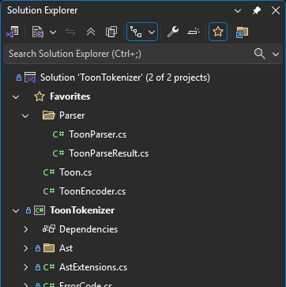
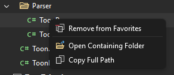

[marketplace]: https://marketplace.visualstudio.com/items?itemName=MadsKristensen.SolutionFavorites
[vsixgallery]: http://vsixgallery.com/extension/SolutionFavorites.9f81ec6e-5c91-4809-9dde-9b3166c327fd/
[repo]: https://github.com/madskristensen/SolutionFavorites

# Solution Favorites for Visual Studio

Download this extension from the [Visual Studio Marketplace][marketplace]
or get the [CI build][vsixgallery].

----------------------------------------

Pin your frequently used files to a **Favorites** node in Solution Explorer for quick access. Organize them into virtual folders and rearrange with drag and drop.

## Features

### Add Files to Favorites

Right-click any file in Solution Explorer and select **Add to Favorites** to pin it.

### Quick Access

All your favorite files appear under a **Favorites** node at the top of Solution Explorer. Double-click to open any file instantly.

### Virtual Folders

Organize your favorites into virtual folders for better organization:

- Right-click the **Favorites** node and select **New Folder** to create a folder at the root level
- Right-click any folder and select **New Folder** to create nested subfolders
- **Rename** or **Remove** folders from the context menu

### Drag and Drop

Rearrange your favorites easily:

- Drag files between folders
- Drag files to the root Favorites node
- Drag folders to reorganize the hierarchy

### Toggle Visibility

Use the **Toggle Favorites** button on the Solution Explorer toolbar to show or hide the Favorites node.

### File Context Menu

Right-click any favorite file to access additional actions:

- **Remove from Favorites** - Unpin the file
- **Open Containing Folder** - Open the file location in Windows Explorer
- **Copy Full Path** - Copy the file path to clipboard

### Missing File Detection

Files that have been moved or deleted are shown with:
- A warning icon overlay
- Italic text style
- "File not found" tooltip

### Per-Solution Storage

Favorites are stored in a `favorites.json` file in the solution directory. This file can be committed to source control so your team can share a common set of favorites. Each solution maintains its own set of favorites that persist across sessions.

If you prefer to keep favorites personal and not share them with your team, simply add `favorites.json` to your `.gitignore` file.

## How can I help?

If you enjoy using the extension, please give it a ★★★★★ rating on the [Visual Studio Marketplace][marketplace].

Found a bug or have a feature idea? Head over to the [GitHub repo][repo] to open an issue.

Pull requests are enthusiastically welcomed!

If you find this extension saves you time, please consider [sponsoring me on GitHub](https://github.com/sponsors/madskristensen).