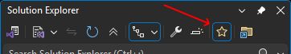

[marketplace]: https://marketplace.visualstudio.com/items?itemName=MadsKristensen.SolutionFavorites
[vsixgallery]: http://vsixgallery.com/extension/SolutionFavorites.9f81ec6e-5c91-4809-9dde-9b3166c327fd/
[repo]: https://github.com/madskristensen/SolutionFavorites

# Solution Favorites for Visual Studio

Download this extension from the [Visual Studio Marketplace][marketplace]
or get the [CI build][vsixgallery].

----------------------------------------

Pin your most important files to the top of Solution Explorer, whether they're in your solution or anywhere else on disk. Stop digging through folders.

This extension adds a **Favorites** node to Solution Explorer where you can organize quick links to the files you use most, including files outside your solution. Built in response to a [highly-requested feature](https://developercommunity.visualstudio.com/t/Pinning-files-on-the-top-of-solution-exp/408940) from the Visual Studio community.

## Quick Start

1. Right-click any file or folder in Solution Explorer → **Add to Favorites**
2. Find your pinned files in the **Favorites** node at the top

## Features

| Feature | Description |
|---------|-------------|
| **Pin Files** | Double-click to instantly open your most-used files |
| **Pin Folders** | Add entire folders with their contents to Favorites |
| **Add External Files** | Browse and add files from anywhere on disk |
| **Virtual Folders** | Organize favorites into custom folder hierarchies |
| **Drag & Drop** | Drag files from Solution Explorer onto Favorites, or rearrange within |
| **Team Sharing** | `favorites.json` lives in your solution folder—commit it to share with your team |
| **Toggle Visibility** | Hide/show Favorites from the Solution Explorer toolbar |
| **Missing File Detection** | Visual indicators when files have been moved or deleted |

### Add Files and Folders

- **From Solution Explorer:** Right-click any file or folder → **Add to Favorites**
- **From Disk:** Right-click the Favorites node or any folder → **Add File...** to browse for files anywhere on your system
- When adding a folder, a matching folder structure is created in Favorites with all contained files

### Organize with Virtual Folders

Create folders to group related favorites. Nest them as deep as you need.

### Drag & Drop Support

- Drag files from Solution Explorer directly onto the Favorites node
- Move files between folders
- Rearrange the hierarchy however you like

### Toggle Visibility

Use the toolbar button to show or hide the Favorites node when you need more space.

### File Context Menu

Right-click any favorite for quick actions:

- Remove from Favorites
- Open Containing Folder  
- Copy Full Path

### Team or Personal

Favorites are stored in `favorites.json` in your solution directory.

- **Share with team:** Commit the file to source control
- **Keep personal:** Add `favorites.json` to `.gitignore`

## Contribute

If you find this extension useful, please:

- ⭐ [Rate it on the Marketplace][marketplace]
- 🐛 [Report issues or request features][repo]
- 💝 [Sponsor development](https://github.com/sponsors/madskristensen)